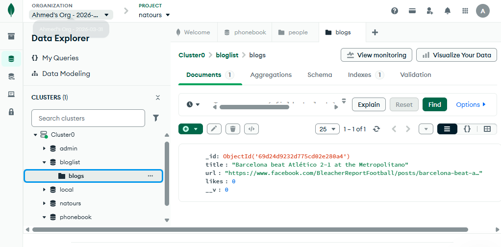

```
------   this is the structure of the project   ------

bloglist/
├── models/
│   └── blog.js          ← Mongoose model
├── controllers/
│   └── blogController.js ← كل الـ CRUD logic
├── routes/
│   └── blogRoutes.js    ← الـ endpoints
├── utils/
│   └── middleware.js    ← logger, unknownEndpoint, errorHandler
├── app.js               ← Express app + MongoDB connection
├── server.js            ← entry point + dotenv
├── package.json
├── .env
└── .gitignore

```
